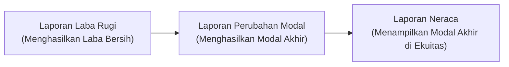

# 📂 Akuntansi: Laporan Buku Besar & Jurnal Penyesuaian
Tags: #accounting #notes #finance

## 1. Apa itu Buku Besar (General Ledger)?
Jika **Jurnal Umum** adalah buku harian tempat kita mencatat semua transaksi secara kronologis (berdasarkan tanggal), maka **Buku Besar** adalah kumpulan "folder" atau "laci" yang mengelompokkan catatan tersebut berdasarkan jenis akunnya (Kas, Piutang, Beban Kopi, Biaya Kos, dll).

* **Analogi:** 
  * *Jurnal Umum:* Timeline Twitter/X (semua tweet masuk berurutan).
  * *Buku Besar:* Album foto di HP (dipisah mana folder foto makanan, folder liburan, dll).
* **Fungsi Utama:** Memudahkan kita melihat riwayat transaksi dan **saldo akhir** dari satu kategori akun secara instan tanpa perlu menyisir seluruh transaksi dari awal.

---

## 2. Hubungan Saldo Buku Besar vs. Saldo Riil (Fisik/Rekening)
Saldo akhir di Buku Besar **wajib sama (matching)** dengan saldo fisik di dunia nyata (uang cash di laci kasir atau saldo di rekening bank).

Jika terjadi **perbedaan** antara Buku Besar dan Saldo Riil, hal ini biasanya disebabkan oleh:
1. **Lupa Mencatat (Human Error):** Mengambil uang kas untuk operasional tetapi lupa diinput ke sistem.
2. **Selisih Waktu (Timing Difference):** Potongan biaya admin bank bulanan atau bunga bank yang sudah terjadi di rekening bank, tapi belum diinput oleh akuntan.
3. **Kehilangan/Selisih Fisik:** Uang hilang, keselip, atau salah memberi kembalian.

> 🔍 **Solusi:** Melakukan **Cash Opname** (hitung fisik uang di laci) atau **Rekonsiliasi Bank** (mencocokkan buku besar bank dengan rekening koran).

---

## 3. Jurnal Penyesuaian (Adjustment Journal)
Ketika ditemukan selisih antara Buku Besar dan Saldo Riil, akuntan akan membuat **Jurnal Penyesuaian** untuk membetulkan catatan tersebut.

* **Di mana dicatat?** Dibuat di dalam **Jurnal Umum (General Journal)**.
* **Kenapa Jurnal Umum?** Karena penyesuaian ini sifatnya tidak rutin harian dan tidak masuk dalam kategori transaksi jual-beli biasa, sehingga Jurnal Umum adalah gerbang paling fleksibel.

### Alur Penyesuaian:
1. Ditemukan selisih (contoh: biaya admin bank Rp15.000 belum dicatat).
2. Input Jurnal Penyesuaian di **Jurnal Umum**:
   ```text
   (Debit)  Beban Admin Bank   Rp15.000
   (Kredit) Kas di Bank                  Rp15.000
   ```


---

# 📊 Akuntansi: Neraca Saldo (Trial Balance)
Tags: #accounting #notes #finance

## 1. Apa itu Neraca Saldo?
**Neraca Saldo** adalah selembar kertas rangkuman yang mengumpulkan seluruh **saldo akhir** dari setiap akun yang ada di **Buku Besar** pada akhir periode (biasanya akhir bulan atau akhir tahun).
* **Analogi:** Lembar absensi sekaligus timbangan akhir bulan untuk memastikan semua laci keuangan terisi dengan benar.
* **Cara Kerja:** Akuntan mendatangi setiap laci Buku Besar, mengambil angka saldo akhirnya, lalu memindahkannya ke dalam daftar satu halaman yang terbagi menjadi dua kolom: **Debit (Kiri)** dan **Kredit (Kanan)**.
---

## 2. Struktur Neraca Saldo (Contoh Sederhana)
Semua akun dideretkan, lalu saldonya dimasukkan ke posisi aslinya (Debit atau Kredit).

| Nama Akun | Debit (Kiri) | Kredit (Kanan) |
| :--- | :--- | :--- |
| Kas | Rp3.460.000 | |
| Beban Kopi | Rp40.000 | |
| Utang Usaha | | Rp1.500.000 |
| Modal | | Rp2.000.000 |
| **TOTAL** | **Rp3.500.000** | **Rp3.500.000** |

---
## 3. Aturan Emas: Harus Balanced (Seimbang) ⚖️
Jumlah total di kolom Debit **wajib sama persis** dengan jumlah total di kolom Kredit.

* **Jika Seimbang (Balanced):** Matematika pencatatan aman. Kemungkinan besar tidak ada kesalahan ketik atau selisih nominal antara debit dan kredit selama penjurnalan.
* **Jika Tidak Seimbang (Out of Balance):** 🚨 Lampu merah! Terjadi kesalahan input (misal: salah memindahkan angka dari jurnal ke buku besar, atau mencatat transaksi pincang sebelah). Akuntan harus menelusuri kembali catatan sebelum membuat laporan keuangan.

---
## 4. Fungsi Utama
Sebagai **alat deteksi dini** untuk memastikan bahwa sistem pencatatan berpasangan (*double-entry*) kita sudah berjalan secara matematis dengan benar sebelum melangkah ke tahap penyusunan Laporan Keuangan.

---
# ⚖️ Akuntansi: Neraca (Balance Sheet)
Tags: #accounting #notes #database #development

## 1. Apa itu Neraca?
**Neraca** adalah laporan keuangan yang menyajikan posisi keuangan perusahaan pada satu titik waktu tertentu (seperti foto/snapshot pada tanggal dan jam tertentu).

* **Analogi:** Foto instan kekayaan bersih hari ini (tidak di-reset ke nol di awal bulan, melainkan terus terakumulasi sepanjang masa hidup perusahaan).
* **3 Akun Utama di Neraca:**
  1. **Aset (Harta):** Apa yang dimiliki (Kas, Bank, Inventory, Kendaraan, Piutang).
  2. **Liabilitas (Utang):** Apa yang dipinjam dari pihak lain (Utang Supplier, Utang Bank).
  3. **Ekuitas (Modal):** Uang milik pemilik (Modal disetor + Laba Ditahan).

---

## 2. Persamaan Akuntansi Dasar (Timbangan Sakral)
Nilai Aset harus selalu sama dengan penjumlahan Utang dan Modal.

$$\text{Aset} = \text{Liabilitas (Utang)} + \text{Ekuitas (Modal)}$$

* **Logika:** Semua harta (Aset) yang dimiliki perusahaan tidak mungkin muncul dari langit; asalnya pasti dari berutang (Liabilitas) atau dari uang pribadi/investor (Ekuitas).

---

## 3. ⚠️ Tips Developer: Mengatasi Bug "Neraca Tidak Balance"
Masalah paling umum saat koding mesin akuntansi adalah laporan Neraca di aplikasi **tidak seimbang** (Aset $\neq$ Utang + Modal). 

### Penyebab:
Laba atau Rugi dari operasional berjalan (yang dihitung dari Laporan Laba Rugi) belum dimasukkan ke dalam komponen Modal di Neraca.

### Solusi Logika Query Backend:
Saat merender Laporan Neraca per tanggal `Target_Date`, backend harus melakukan kalkulasi ini secara dinamis:

1. **Hitung Aset:** Sum `debit - credit` dari awal waktu sampai `Target_Date` untuk semua akun tipe Aset.
2. **Hitung Utang:** Sum `credit - debit` dari awal waktu sampai `Target_Date` untuk semua akun tipe Liabilitas.
3. **Hitung Modal Awal:** Sum `credit - debit` dari awal waktu sampai `Target_Date` untuk semua akun tipe Ekuitas.
4. **Hitung Laba/Rugi Berjalan (KUNCI):** 
   Lakukan query Laba Rugi terpisah untuk periode berjalan (dari awal tahun fiskal sampai `Target_Date`):
   $$\text{Laba Bersih} = \text{Total Pendapatan} - \text{Total Beban}$$
5. **Gabungkan:** 
   $$\text{Total Ekuitas Akhir} = \text{Modal Awal} + \text{Laba Bersih}$$
   
Dengan cara ini, persamaan Neraca akan terbukti seimbang:
$$\text{Total Aset} = \text{Total Utang} + \text{Total Ekuitas Akhir}$$---
# 💸 Akuntansi: Laporan Arus Kas (Cash Flow Statement)
Tags: #accounting #notes #database #algorithm #development

## 1. Apa itu Laporan Arus Kas?
Laporan Arus Kas adalah laporan yang mencatat mutasi uang fisik (masuk dan keluar) secara **Cash Basis** pada periode tertentu.

* **Beda dengan Laba Rugi:** 
  * Laba Rugi memakai *Accrual Basis* (mencatat pendapatan meskipun uang fisiknya belum diterima/masih berupa piutang).
  * Arus Kas memakai *Cash Basis* (hanya mencatat ketika uang secara fisik benar-benar berpindah tangan).
* **Cakupan Akun:** Hanya memantau akun-akun yang tergolong dalam **Kas & Setara Kas** (Kas Kecil, Rekening Bank, Deposito < 3 bulan) yang berada di bawah kelompok `1000 - Aset`.

---

## 2. Tiga Kategori Arus Kas & Pemetaan Akun Lawan
Dalam laporan, arus kas dibagi menjadi 3 aktivitas. Di tingkat backend, kategorisasi ditentukan dengan melihat **Akun Lawan (Offsetting Account)** pada jurnal transaksi kas tersebut:

| Kategori Arus Kas | Jenis Aktivitas | Kriteria Akun Lawan (COA) | Contoh Transaksi |
| :--- | :--- | :--- | :--- |
| **Operasional** *(Operating)* | Kegiatan operasional harian bisnis. | Kepala `4000` (Pendapatan), `5000` (Beban), Aset Lancar (Piutang), Kewajiban Lancar (Utang Usaha). | Terima bayar es teh, bayar gaji, bayar listrik, pelanggan bayar piutang. |
| **Investasi** *(Investing)* | Jual/beli aset jangka panjang. | Kepala `1000` khusus sub-akun **Aset Tetap** (Non-Lancar). | Beli laptop kantor, beli mesin es, jual mobil operasional bekas. |
| **Pendanaan** *(Financing)* | Terkait modal pemilik & utang bank. | Kepala `3000` (Ekuitas) & Kepala `2000` khusus **Kewajiban Jangka Panjang**. | Pemilik setor modal, tarik Prive, terima pinjaman bank, bayar pokok utang bank. |

---
## 3. ⚙️ Aturan Emas Algoritma Cash Flow (Untuk Developer)

### A. Deteksi Kategori Menggunakan Akun Lawan
Saat sistem melakukan query pada tabel `journal_items` untuk menyusun Arus Kas:
1. Filter baris yang menggunakan akun kelompok **Kas & Setara Kas**.
2. Cari baris lawan (*offsetting line*) dalam `journal_entry_id` yang sama.
3. Baca tipe COA dari baris lawan tersebut untuk menentukan apakah transaksi masuk kategori **Operasional**, **Investasi**, atau **Pendanaan**.

### B. Filter Transfer Internal (Penting!) ⚠️
User akan sering melakukan transfer uang antar rekening bank perusahaan (misal: Tarik tunai dari Bank BCA ke Kas Kecil, atau transfer Bank Mandiri ke BCA).

* **Logika Jurnal:** 
  * (Debit) Kas Kecil / Bank BCA
  * (Kredit) Bank Mandiri
* **Aturan Algoritma:** **ABAIKAN transaksi ini dari Laporan Arus Kas.**
* **Alasan:** Total nilai kelompok "Kas & Setara Kas" secara keseluruhan tidak berubah (hanya pindah kantong).
* **Implementasi Code:** Jika dalam satu `journal_entry_id`, akun di sisi Debit dan Kredit **sama-sama** bertipe **Kas & Setara Kas**, maka baris transaksi tersebut harus di-*skip* (tidak dimasukkan ke laporan).
---
# 📈 Akuntansi: Laporan Perubahan Modal (Statement of Changes in Equity)
Tags: #accounting #notes #database #logic #development

## 1. Apa itu Laporan Perubahan Modal?
Laporan Perubahan Modal adalah laporan keuangan yang mencatat pergerakan naik-turunnya nilai modal (ekuitas) pemilik bisnis selama periode tertentu.

* **Analogi:** Buku catatan celengan modal milik bos/pemilik usaha untuk memantau apakah investasinya berkembang atau menyusut.
* **Cakupan Akun:** Fokus hanya pada akun kelompok **`3000 - Ekuitas`** di COA (seperti Modal Disetor, Prive/Drawings, dan Laba Ditahan).

---

## 2. Rumus Laporan Perubahan Modal
Untuk menghitung saldo akhir modal di akhir periode:

$$\text{Modal Akhir} = \text{Modal Awal} + \text{Setoran Modal Baru} + \text{Laba Bersih} - \text{Prive (Ambil Uang Pribadi)}$$

* **Prive / Dividen (Drawings):** Pengambilan aset atau uang perusahaan oleh pemilik untuk kepentingan pribadi (mengurangi modal).
* **Laba/Rugi Bersih:** Diambil dari hasil akhir Laporan Laba Rugi periode berjalan.

---

## 3. Peran sebagai Jembatan Laporan Keuangan 🌉
Laporan ini berfungsi menghubungkan Laporan Laba Rugi dengan Laporan Neraca:


## 4. ⚙️ Logika Query Database di Backend

Jika user memanggil Laporan Perubahan Modal untuk rentang tanggal `Start_Date` sampai `End_Date`:

1. **Hitung Modal Awal:** Jumlahkan saldo (Credit - Debit) semua akun ekuitas (seperti `3100 - Modal Disetor` dan `3300 - Laba Ditahan`) dari awal waktu transaksi (`date_created`) hingga tepat satu hari sebelum `Start_Date`.
2. **Hitung Setoran Tambahan:** Sum transaksi Kredit pada akun modal disetor (`3100`) khusus di dalam rentang `Start_Date` s/d `End_Date`.
3. **Ambil Laba/Rugi Bersih:** Panggil fungsi kalkulator Laba Rugi untuk rentang `Start_Date` s/d `End_Date`.
4. **Hitung Prive:** Sum transaksi Debit pada akun Prive (`3200`) khusus di dalam rentang `Start_Date` s/d `End_Date`.
5. **Kalkulasi Akhir:** Gabungkan hasil poin 1 s/d 4 sesuai rumus untuk menghasilkan **Modal Akhir**. Nilai ini harus dikirimkan untuk merender kelompok Ekuitas di Laporan Neraca per tanggal `End_Date`.
```text
Catatan ini melengkapi seri laporan keuangan utama yang sedang kamu riset untuk aplikasimu! Jika ada topik lanjutan seperti *Jurnal Penyesuaian*, *Tutup Buku Tahunan*, atau struktur tabel database lainnya, silakan tanyakan saja.
```
---
# 🪙 Akuntansi: Ekuitas (Equity / Modal)
Tags: #accounting #notes #database #logic #development

## 1. Apa itu Ekuitas?
**Ekuitas** adalah nilai kepemilikan bersih atas harta perusahaan setelah dikurangi semua kewajiban/utang.

* **Analogi:** Hak milik bersih. Jika kamu beli laptop seharga Rp10 juta (Aset), bayar pakai utang kartu kredit Rp3 juta (Liabilitas) dan uang cash pribadimu Rp7 juta (Ekuitas), maka bagian laptop yang benar-benar bersih milikmu adalah senilai Rp7 juta.
* **Persamaan Akuntansi:**
  $$\text{Ekuitas} = \text{Aset} - \text{Liabilitas (Utang)}$$

---

## 2. Struktur Sub-Akun Ekuitas (COA Kepala 3000)
Di dalam Chart of Accounts (COA), kelompok Ekuitas biasanya terdiri dari:

1. **Modal Disetor (Paid-in Capital):** Setoran awal berupa uang/aset dari pemilik ke perusahaan.
2. **Prive / Dividen (Drawings):** Penarikan uang atau aset perusahaan oleh pemilik untuk kepentingan pribadi.
3. **Laba Ditahan (Retained Earnings):** Akumulasi keuntungan tahun-tahun lalu yang tidak diambil dan diputar kembali sebagai modal kerja.
4. **Laba Tahun Berjalan (Current Year Earnings):** Penampung dinamis dari selisih `Pendapatan - Beban` tahun fiskal saat ini.

---

## 3. ⚙️ Catatan Logika Database & Koding (Developer Note)

### A. Arah Saldo Akun Prive (Contra-Equity)
Secara umum, kelompok Ekuitas bertambah di sisi **Kredit**. Namun, khusus untuk akun **Prive / Dividen**, sifatnya adalah mengurangi ekuitas.
* **Database Rule:** Akun Prive harus diatur dengan arah `normal_balance = debit`.
* **Kalkulasi Total Ekuitas:**
  $$\text{Total Ekuitas} = \text{Modal Disetor (Credit)} + \text{Laba Ditahan (Credit)} + \text{Laba Berjalan (Credit)} - \text{Prive (Debit)}$$

### B. Mekanisme Proses Tutup Buku Akhir Tahun (Year-End Closing)
Di akhir tahun fiskal (misal: 31 Desember jam 23:59:59), backend sistem harus menjalankan query otomatis untuk memindahkan saldo:
1. Pindahkan total saldo dari akun **Laba Tahun Berjalan** (`3400`) ke akun **Laba Ditahan** (`3300`).
2. Buat saldo akun **Laba Tahun Berjalan** (`3400`) kembali menjadi **nol (0)** untuk memulai tahun fiskal baru per 1 Januari.