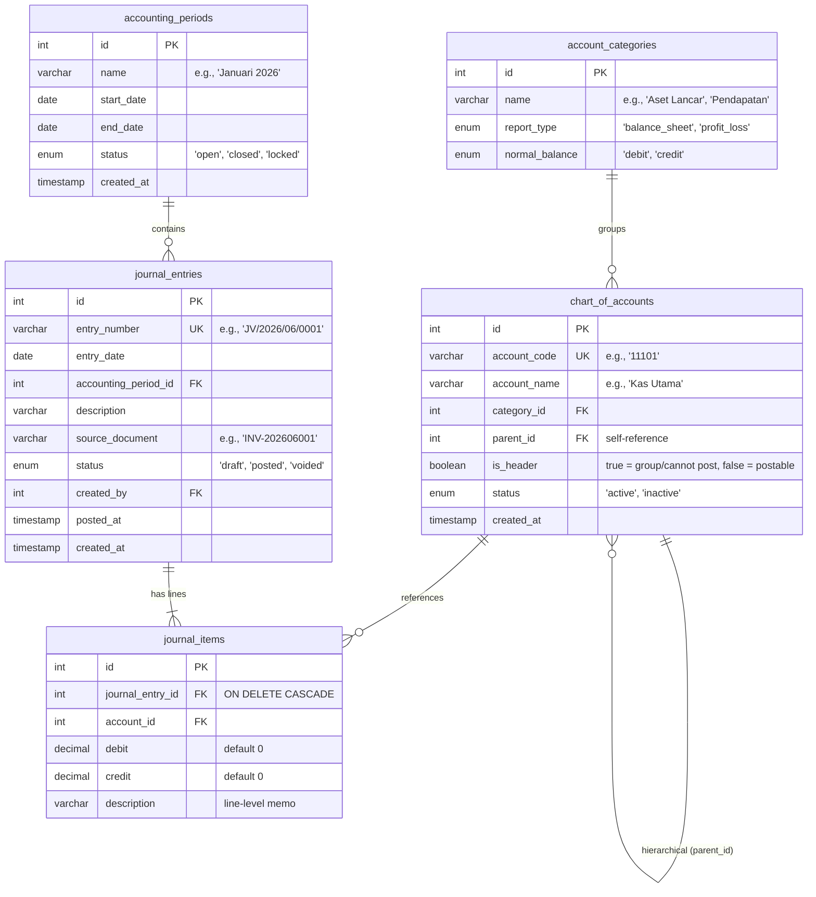
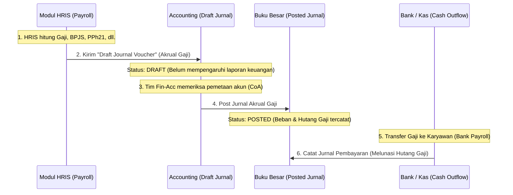

Dokumen ini menjelaskan rancangan *Entity Relationship Diagram* (ERD) untuk inti modul Keuangan dan Akuntansi, yang mencakup pengaturan **Bagan Akun (Chart of Accounts)**, **Pencatatan Jurnal (Double-Entry Bookkeeping)**, dan **Periode Akuntansi**.

---

## 1. Diagram ERD (Mermaid)

Berikut adalah visualisasi hubungan antar tabel dalam database keuangan menggunakan diagram Mermaid:

---

## 2. Struktur Tabel & Penjelasannya

### A. Tabel `accounting_periods` (Periode Akuntansi)
Berfungsi untuk membatasi transaksi pada rentang waktu tertentu. Ini mencegah pencatatan transaksi di masa lalu atau masa depan secara tidak sengaja, serta memfasilitasi proses penutupan buku (*closing*).

| Nama Kolom | Tipe Data | Atribut | Keterangan |
| :--- | :--- | :--- | :--- |
| `id` | INT | PK, Auto Increment | ID unik periode. |
| `name` | VARCHAR(50) | Not Null | Nama periode (contoh: "Juni 2026"). |
| `start_date` | DATE | Not Null | Tanggal awal periode (contoh: `2026-06-01`). |
| `end_date` | DATE | Not Null | Tanggal akhir periode (contoh: `2026-06-30`). |
| `status` | ENUM | Not Null | Status periode: `open` (aktif), `closed` (tutup buku bulanan), `locked` (sudah diaudit, tidak boleh diubah). |

---

### B. Tabel `account_categories` (Kategori Akun)
Pengelompokan tingkat atas untuk Bagan Akun (CoA). Memudahkan penyusunan laporan keuangan (Neraca atau Laba Rugi).

| Nama Kolom | Tipe Data | Atribut | Keterangan |
| :--- | :--- | :--- | :--- |
| `id` | INT | PK, Auto Increment | ID unik kategori. |
| `name` | VARCHAR(100) | Not Null | Nama kategori (contoh: "Aset Lancar", "Kewajiban Jangka Panjang", "Pendapatan Operasional"). |
| `report_type` | ENUM | Not Null | Jenis laporan: `balance_sheet` (Neraca) atau `profit_loss` (Laba Rugi). |
| `normal_balance` | ENUM | Not Null | Saldo normal: `debit` atau `credit`. Menentukan apakah penambahan nilai akun dilakukan di debit atau kredit. |

---

### C. Tabel `chart_of_accounts` (Bagan Akun / CoA)
Daftar seluruh akun yang digunakan untuk mencatat transaksi keuangan perusahaan. Menggunakan relasi *self-reference* (`parent_id`) untuk membentuk struktur pohon/hierarki.

| Nama Kolom | Tipe Data | Atribut | Keterangan |
| :--- | :--- | :--- | :--- |
| `id` | INT | PK, Auto Increment | ID unik akun. |
| `account_code` | VARCHAR(20) | Unique, Not Null | Kode unik akun (contoh: `11101` untuk Kas, `11201` untuk Bank A). |
| `account_name` | VARCHAR(150) | Not Null | Nama akun (contoh: "Kas Utama IDR"). |
| `category_id` | INT | FK to `account_categories` | Kategori dasar dari akun tersebut. |
| `parent_id` | INT (Nullable) | FK to `chart_of_accounts` | Akun induk jika akun ini merupakan sub-akun. |
| `is_header` | BOOLEAN | Default: `false` | `true` jika akun hanya berfungsi sebagai judul/penampung kelompok (tidak boleh menerima jurnal langsung). `false` jika akun aktif menerima transaksi. |
| `status` | ENUM | Default: `active` | Menentukan apakah akun aktif atau tidak aktif (`active`, `inactive`). |

---

### D. Tabel `journal_entries` (Header Jurnal)
Menyimpan informasi umum dari suatu transaksi jurnal (siapa, kapan, deskripsi umum, dokumen sumber).

| Nama Kolom | Tipe Data | Atribut | Keterangan |
| :--- | :--- | :--- | :--- |
| `id` | INT | PK, Auto Increment | ID unik entri jurnal. |
| `entry_number` | VARCHAR(50) | Unique, Not Null | Nomor bukti jurnal otomatis (contoh: `JV/2026/06/0001` atau `INV/2026/004`). |
| `entry_date` | DATE | Not Null | Tanggal transaksi akuntansi. |
| `accounting_period_id` | INT | FK to `accounting_periods` | Menunjukkan transaksi ini terjadi di periode akuntansi yang mana. |
| `description` | TEXT | Nullable | Keterangan umum transaksi (contoh: "Pembayaran sewa gedung"). |
| `source_document` | VARCHAR(100) | Nullable | Referensi dokumen sumber (contoh: nomor invoice penjualan, nomor PO, dll.). |
| `status` | ENUM | Default: `draft` | Status jurnal: `draft` (belum diposting/bisa diedit), `posted` (sudah masuk buku besar/terkunci), `voided` (dibatalkan). |
| `created_by` | INT | FK to Users | ID user yang membuat jurnal. |
| `posted_at` | TIMESTAMP | Nullable | Waktu jurnal diposting ke buku besar. |

---

### E. Tabel `journal_items` (Detail/Baris Jurnal)
Menyimpan rincian pembukuan (debit/kredit) dari setiap akun yang terlibat dalam transaksi jurnal. Satu jurnal wajib memiliki minimal dua baris detail (Double-Entry).

| Nama Kolom | Tipe Data | Atribut | Keterangan |
| :--- | :--- | :--- | :--- |
| `id` | INT | PK, Auto Increment | ID unik baris jurnal. |
| `journal_entry_id` | INT | FK to `journal_entries` | Relasi ke header jurnal (dihapus otomatis jika header dihapus). |
| `account_id` | INT | FK to `chart_of_accounts` | Akun yang didebit atau dikredit. Harus berupa akun dengan `is_header = false`. |
| `debit` | DECIMAL(15,2) | Default: `0.00` | Nilai debit dalam transaksi. |
| `credit` | DECIMAL(15,2) | Default: `0.00` | Nilai kredit dalam transaksi. |
| `description` | VARCHAR(255) | Nullable | Catatan spesifik untuk baris akun ini (memo baris). |

---

## 3. Aturan Bisnis & Validasi (Business Rules)

Untuk menjaga integritas data akuntansi, sistem ERP harus menerapkan aturan validasi berikut pada level aplikasi atau database:

1. **Prinsip Double-Entry (Keseimbangan Jurnal):**
   * Setiap kali `journal_entries.status` diubah menjadi `posted`, sistem harus memvalidasi bahwa total debit sama dengan total kredit pada tabel `journal_items`.
   * Rumus: `SUM(debit) = SUM(credit)` untuk setiap `journal_entry_id`. Jika tidak seimbang, transaksi ditolak.

2. **Validasi Periode Akuntansi:**
   * Transaksi hanya boleh dibuat atau diposting jika tanggal `entry_date` berada di dalam rentang `start_date` dan `end_date` dari periode akuntansi yang berstatus `open`.
   * Jika periode sudah `closed` atau `locked`, user tidak boleh menambahkan, mengubah, atau menghapus transaksi pada periode tersebut.

3. **Validasi Akun Transaksional (Posting Restriction):**
   * Transaksi pada `journal_items` hanya boleh menggunakan akun yang berstatus `active` dan memiliki nilai `is_header = false` (bukan akun induk/header).

4. **Kekekalan Jurnal yang Terposting (Audit Trail):**
   * Jurnal dengan status `posted` tidak boleh diedit atau dihapus secara langsung. 
   * Jika ada kesalahan transaksi, user harus melakukan mekanisme **Jurnal Balik / Jurnal Koreksi (Reversing Entry)** atau mengubah status menjadi `voided` yang akan melahirkan log pembatalan.

---

## 4. Alur Integrasi HRIS & Accounting (Payroll Integration)

Pertanyaan krusial dalam integrasi ERP adalah: **Bagaimana menyinkronkan data penggajian dari HRIS ke Accounting tanpa memicu pencatatan ganda (*double posting*) atau kebingungan saldo?**

Kuncinya adalah menggunakan metode **Akrual (Pencatatan Hutang Terlebih Dahulu)**, bukan pencatatan langsung ke kas/bank pada saat payroll dihitung.

### A. Alur Kerja Integrasi (Workflow)

---

### B. Pola Pencatatan Jurnal (Double-Entry)

Agar tidak terjadi pencatatan biaya ganda, pencatatan dibagi menjadi dua fase:

#### Fase 1: Pengakuan Beban & Hutang (Jurnal Akrual)
Dilakukan otomatis oleh sistem begitu payroll di HRIS selesai dihitung dan disetujui (*Locked/Approved*). Pada fase ini, **uang belum keluar dari bank**, tetapi perusahaan sudah wajib mencatat pengeluaran tersebut sebagai beban periode berjalan dan hutang.

*   **Debet:** `Beban Gaji` (Mencatat biaya gaji karyawan)
*   **Debet:** `Beban BPJS - Porsi Perusahaan` (Biaya BPJS yang ditanggung perusahaan)
*   **Kredit:** `Hutang Gaji` (Kewajiban bersih yang harus ditransfer ke karyawan)
*   **Kredit:** `Hutang PPh 21` (Titipan pajak karyawan yang akan disetor ke negara)
*   **Kredit:** `Hutang BPJS` (Gabungan porsi perusahaan + porsi potongan karyawan)

> [!NOTE]
> Perhatikan bahwa semua potongan (BPJS porsi karyawan, PPh 21) tidak memunculkan beban baru bagi perusahaan. Potongan tersebut langsung mengurangi hak bersih karyawan (`Hutang Gaji`) dan dialihkan ke akun hutang penampung lainnya (`Hutang PPh 21` dan `Hutang BPJS`).

#### Fase 2: Pembayaran Fisik (Disbursement)
Dilakukan oleh tim Keuangan saat proses transfer bank/pembayaran dilakukan (misalnya via *Bank Corporate Payable* atau cek).

1. **Saat Transfer Gaji Karyawan:**
   *   **Debet:** `Hutang Gaji` (Menghapus/mengurangi kewajiban hutang gaji)
   *   **Kredit:** `Kas / Bank` (Uang keluar dari rekening bank perusahaan)

2. **Saat Menyetor PPh 21 ke Kas Negara:**
   *   **Debet:** `Hutang PPh 21` (Menghapus hutang pajak)
   *   **Kredit:** `Kas / Bank` (Uang keluar ke kas negara)

3. **Saat Menyetor BPJS ke BPJS Kesehatan/Ketenagakerjaan:**
   *   **Debet:** `Hutang BPJS` (Menghapus hutang BPJS)
   *   **Kredit:** `Kas / Bank` (Uang keluar ke BPJS)

---

### C. Mengapa Cara Ini Mencegah Double Posting?

1. **Pemisahan Peran Akun Riil (Hutang) dan Akun Nominal (Beban):**
   * Beban gaji hanya diakui **satu kali** pada **Fase 1** (saat akrual).
   * Pada **Fase 2** (saat uang keluar), akun yang di-debit adalah akun **Hutang Gaji**, bukan akun Beban Gaji lagi. Dengan begitu, biaya gaji tidak terhitung dua kali di Laporan Laba Rugi (*Profit & Loss*).

2. **Mekanisme Jurnal Draft:**
   * Data dari HRIS tidak langsung masuk ke Buku Besar (*Posted*). Data masuk sebagai **Draft Journal Entry** terlebih dahulu.
   * Tim Finance & Accounting berkesempatan memverifikasi CoA, jumlah total, dan melakukan koreksi sebelum diposting secara final.
