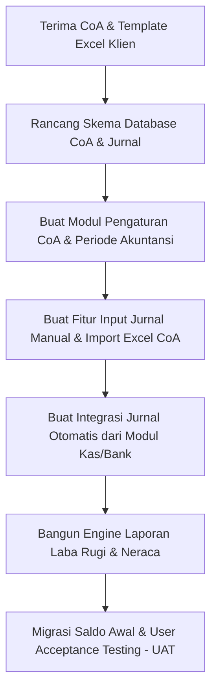

# Panduan Requirements Gathering: Migrasi Akuntansi dari Excel ke Aplikasi Custom

Dokumen ini berisi daftar pertanyaan wawancara (*discovery questions*) dan daftar data prasyarat (*prerequisites*) yang perlu Anda ajukan ke klien. Panduan ini dirancang khusus untuk membantu transisi pencatatan keuangan dari **spreadsheet (Excel)** ke **sistem database terstruktur**.

---

## 1. Daftar Pertanyaan Kunci (Discovery Questions)

Gunakan pertanyaan-pertanyaan ini saat sesi diskusi pertama dengan klien untuk memetakan ruang lingkup (*scope*) proyek aplikasi.

### A. Alur Kerja Saat Ini & Masalah Utama (Current Workflow & Pain Points)
*   [ ] **Bagaimana alur pencatatan transaksi harian saat ini di Excel?** 
    * *Tujuan:* Memahami apakah mereka mencatat per transaksi langsung ke jurnal umum, atau memiliki beberapa file Excel terpisah (misal: Excel khusus Kas Masuk, Excel khusus Kas Keluar, Excel Invoice).
*   [ ] **Siapa saja yang berhak menginput data keuangan dan apa peran mereka?**
    * *Tujuan:* Menentukan kebutuhan modul User Management (RBAC - *Role-Based Access Control*), misalnya operator kasir hanya bisa input kas masuk, sedangkan manajer finance yang memposting ke buku besar.
*   [ ] **Apa batasan atau masalah terbesar yang dihadapi dengan Excel saat ini?**
    * *Tujuan:* Menentukan fitur prioritas (*killing features*). Biasanya masalahnya: rumus terhapus, data tidak sinkron jika dibuka banyak orang, file lambat dibuka, atau tidak ada *audit trail* (siapa yang mengubah data tidak ketahuan).

### B. Kebutuhan Fitur & Skalabilitas (Features & Scope)
*   [ ] **Apakah bisnis Anda memiliki beberapa entitas/anak perusahaan (Multi-Company)?**
    * *Tujuan:* Menentukan arsitektur database. Apakah butuh fitur konsolidasi keuangan antar cabang/anak perusahaan atau cukup satu entitas saja.
*   [ ] **Apakah transaksi Anda melibatkan banyak mata uang (Multi-Currency)?**
    * *Tujuan:* Menentukan apakah sistem harus mendukung kurs harian, pencatatan mata uang asing, dan perhitungan otomatis selisih kurs.
*   [ ] **Apakah pencatatan biaya perlu dikelompokkan per proyek atau per departemen (Cost Center)?**
    * *Tujuan:* Menentukan apakah kolom detail jurnal (`journal_items`) membutuhkan relasi tambahan ke tabel `projects` atau `departments`.
*   [ ] **Apakah ada sistem lain yang harus terintegrasi dengan aplikasi ini kelak?** (Contoh: Aplikasi POS Kasir, Sistem Gudang/Inventory, HRIS/Payroll).
    * *Tujuan:* Mempersiapkan API endpoints pada aplikasi akunting agar siap menerima data transaksi eksternal secara otomatis.

### C. Output & Pelaporan (Reporting Requirements)
*   [ ] **Laporan keuangan apa saja yang wajib dihasilkan oleh aplikasi ini?**
    * *Tujuan:* Memastikan struktur database CoA mendukung format laporan tersebut. Minimal: Laba Rugi (*Profit & Loss*), Neraca (*Balance Sheet*), dan Buku Besar (*General Ledger*).
*   [ ] **Apakah ada format laporan khusus yang diminta oleh manajemen atau auditor eksternal?**
    * *Tujuan:* Menghindari desain ulang format ekspor laporan (PDF/Excel) di akhir proyek.

---

## 2. Daftar Data Prasyarat yang Harus Diminta (Prerequisites Checklist)

Mintalah file-file berikut dalam format Excel asli mereka agar Anda memiliki bahan mentah untuk merancang skema database dan melakukan *mockup data*.

| Kategori Data | Dokumen yang Diminta | Kegunaan Bagi Developer |
| :--- | :--- | :--- |
| **Master Bagan Akun** | File Excel berisi daftar **Chart of Accounts (CoA)** lengkap dengan kode akun, nama akun, kategori, dan saldo normal. | Dasar untuk seeding tabel `chart_of_accounts`. |
| **Template Transaksi Harian** | Salinan file Excel yang saat ini aktif digunakan untuk mencatat jurnal harian atau kas masuk/keluar. | Untuk menganalisis kolom apa saja yang mereka butuhkan (contoh: nomor cek, nama proyek, nama sales, dll.) agar bisa diakomodasi di tabel `journal_items`. |
| **Contoh Laporan Keuangan** | Contoh Laporan Laba Rugi dan Neraca versi Excel mereka (boleh menggunakan data fiktif jika rahasia). | Sebagai acuan formula hitung (rumus penjumlahan kelompok akun) dan *layout* akhir yang akan di-generate oleh sistem. |
| **Data Master Pendukung** | Daftar Pelanggan (Customers), Vendor/Supplier, Bank perusahaan, dan daftar Pajak yang berlaku. | Bahan untuk mendesain tabel master relasional di database. |
| **Saldo Awal Akuntansi** | Neraca Penutup (*Trial Balance*) per tanggal cut-off migrasi sistem (misalnya per 31 Desember tahun lalu). | Angka awal yang akan dimasukkan ke sistem baru saat *go-live* agar saldo kumulatifnya cocok. |

---

## 3. Rekomendasi Tahapan Pengerjaan (Milestones)

Setelah mendapatkan data prasyarat di atas, berikut adalah urutan pengerjaan yang disarankan agar proyek berjalan terarah:

### Tips Sukses untuk Developer:
> [!TIP]
> **Buat Fitur Import Excel untuk CoA:** Klien yang terbiasa dengan Excel akan sangat menghargai jika mereka tidak perlu mengetik ratusan akun CoA satu per satu di aplikasi Anda. Fitur import `.xlsx` / `.csv` untuk CoA adalah penyelamat waktu.
