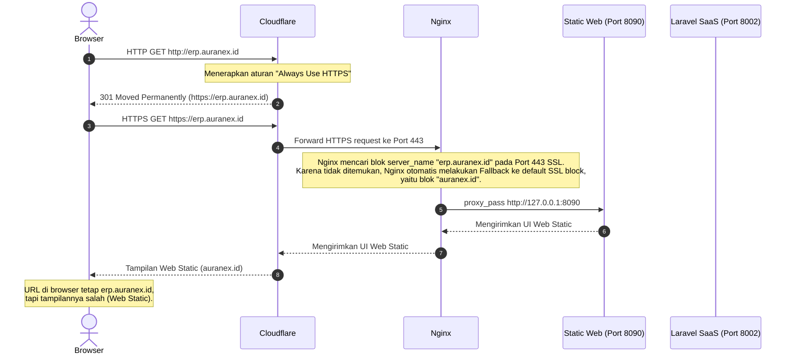
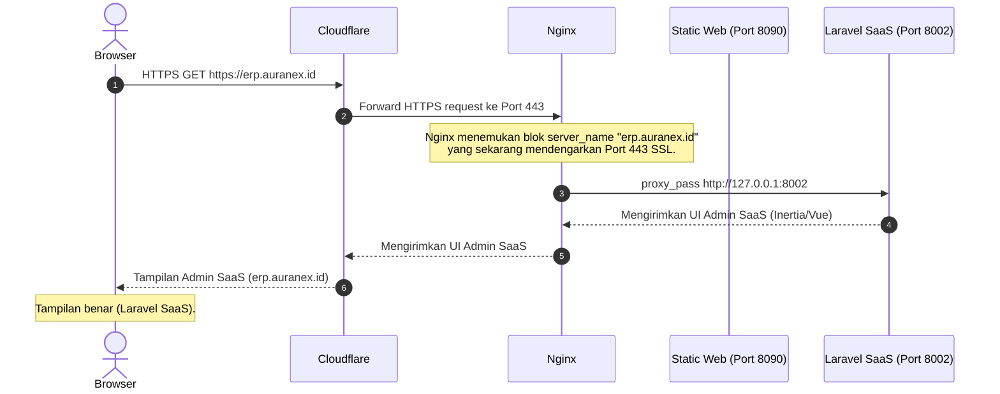

![[Pasted image 20260604223757.png]]
Dokumentasi ini menjelaskan fenomena **SSL Fallback** pada Nginx, di mana request HTTPS ke subdomain tertentu didelegasikan ke domain lain yang memiliki SSL aktif karena subdomain tersebut belum dikonfigurasi untuk mendengarkan port 443 (SSL).

---

## 1. Alur Masalah: SSL Fallback (Salah Tampilan)

Alur ini menjelaskan mengapa ketika mengakses `https://erp.auranex.id`, Nginx malah menampilkan halaman web static `auranex.id`.

### Squence Diagram


### Kode untuk sequencediagram.org
Anda dapat menyalin kode di bawah ini langsung ke editor [sequencediagram.org](https://sequencediagram.org):

```text
title Nginx SSL Fallback Flow (Salah Tampilan)

actor Browser
participant Cloudflare
participant Nginx
database Static Web (Port 8090)
database Laravel SaaS (Port 8002)

Browser->Cloudflare: HTTP GET http://erp.auranex.id
note over Cloudflare: Redirect ke HTTPS ("Always Use HTTPS" aktif)
Cloudflare->Browser: HTTP 301 Redirect to https://erp.auranex.id

Browser->Cloudflare: HTTPS GET https://erp.auranex.id
Cloudflare->Nginx: Forward HTTPS Request (Port 443)

note over Nginx:
  Nginx mencari block 'erp.auranex.id' pada port 443 SSL.
  Karena tidak ada, Nginx fallback ke satu-satunya block SSL
  yang aktif yaitu 'auranex.id' (Port 443).
end note

Nginx->Static Web (Port 8090): proxy_pass http://127.0.0.1:8090
Static Web (Port 8090)->Nginx: Kirim UI Web Static
Nginx->Cloudflare: Kirim UI Web Static
Cloudflare->Browser: Tampilan Web Static (auranex.id)
note over Browser: Browser menampilkan UI yang salah (Static Web)!
```

---

## 2. Alur Solusi: Setelah SSL Aktif (Tampilan Benar)

Alur ini menjelaskan proses routing setelah sertifikat SSL dipasang pada `erp.auranex.id` (menggunakan Certbot atau mode Flexible Cloudflare).

### Mermaid Diagram


### Kode untuk sequencediagram.org
Anda dapat menyalin kode di bawah ini langsung ke editor [sequencediagram.org](https://sequencediagram.org):

```text
title Nginx Routing Correct Flow (Tampilan Benar)

actor Browser
participant Cloudflare
participant Nginx
database Static Web (Port 8090)
database Laravel SaaS (Port 8002)

Browser->Cloudflare: HTTPS GET https://erp.auranex.id
Cloudflare->Nginx: Forward HTTPS Request (Port 443)

note over Nginx:
  Nginx menemukan block 'erp.auranex.id'
  yang sudah mendengarkan Port 443 SSL.
end note

Nginx->Laravel SaaS (Port 8002): proxy_pass http://127.0.0.1:8002
Laravel SaaS (Port 8002)->Nginx: Kirim UI Admin SaaS
Nginx->Cloudflare: Kirim UI Admin SaaS
Cloudflare->Browser: Tampilan Admin SaaS
note over Browser: Browser menampilkan UI yang benar (Laravel SaaS)!
```

---

> [!TIP]
> **Poin Penting untuk Diingat:**
> Nginx bekerja secara bertahap dalam mencocokkan request:
> 1. Mencocokkan **Port / IP** terlebih dahulu (`listen`).
> 2. Baru mencocokkan **Domain** (`server_name`).
> Jika port cocok tetapi domain tidak terdaftar pada port tersebut, Nginx akan melimpahkan request ke server block pertama (default) yang mendengarkan port tersebut.